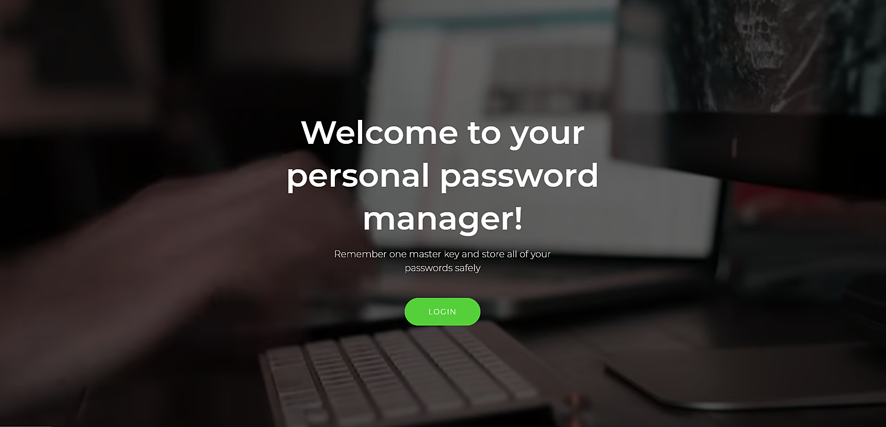
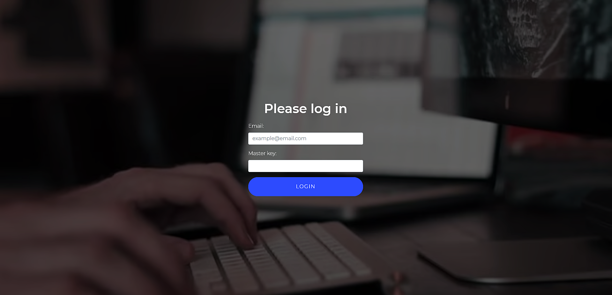
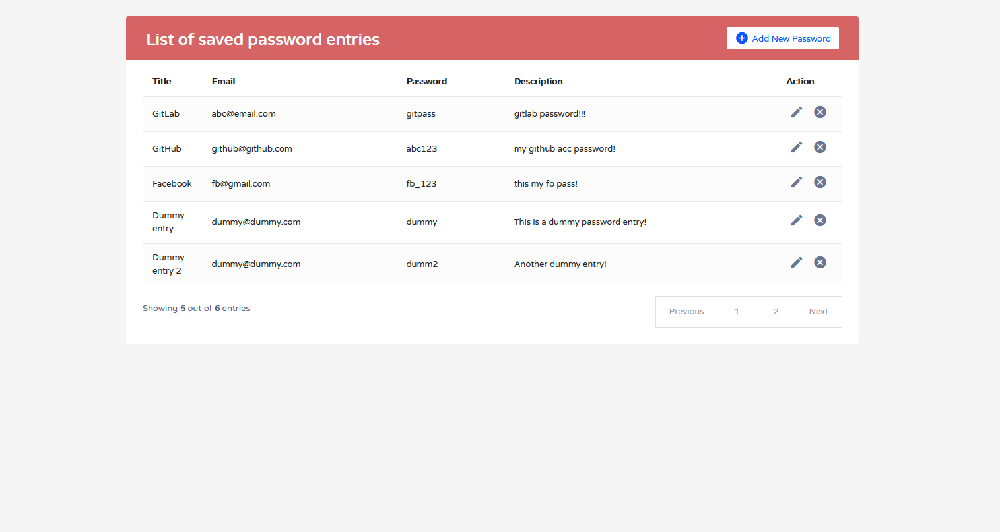
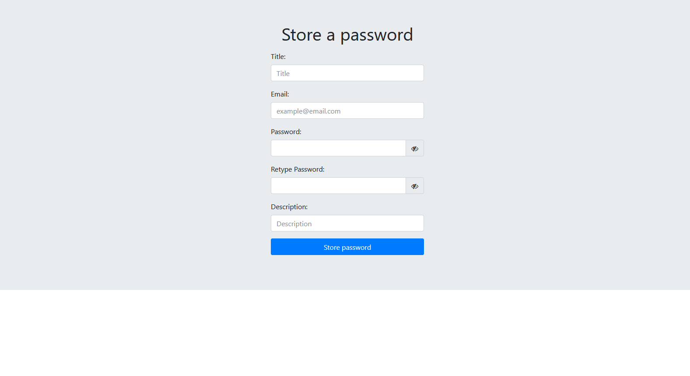
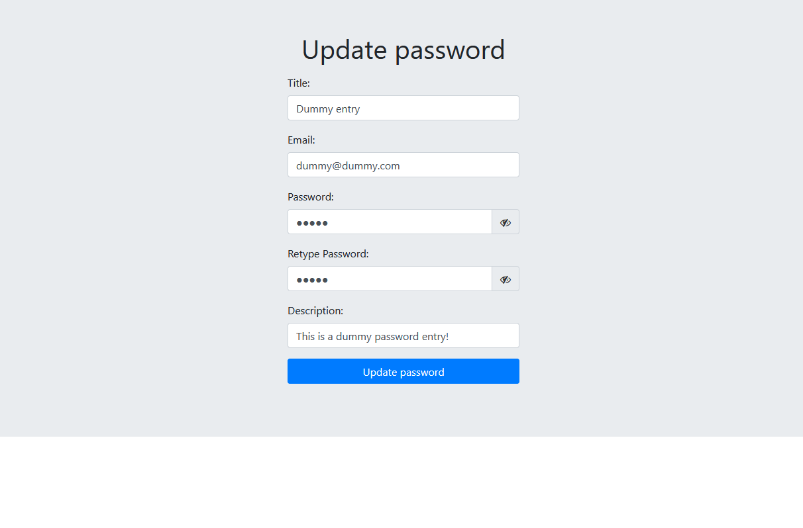
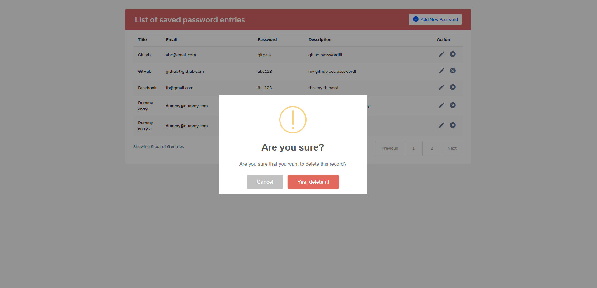

# Personal_Password_Manager
- This is a very simple web application developed for mainly personal useage. The user sign up option is not available, hence, it can be used mainly for personal use. The passwords are saved encrypted in the database, hence, no need to worry about the security.

- Developed using: 
    - Backend: Flask, MongoDB-atlas
    - Frontend: HTML, CSS, JS, jQuery, Bootstrap

- Here are some screenshots of the web application:
    - First landing page: 
    
    - Login page:
    
    - Home page after login:
    
    - Add new password page:
    
    - Update existing password page:
    
    - Delete existing password record:
    